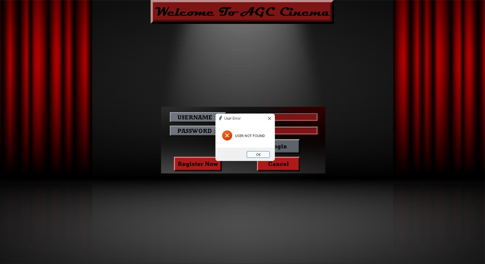

This project is about Cinema Management using Python Tkinter 
Just simply download the zip file and then replace the `username and password` with your own username and password of your oracle database in `Login.py` file at line no:-`100`.

The password  and username for accessing the manager page is :`manager/man123`

You have to create some tables tables in order to run project in your machine.

TNAME                          TABTYPE 
------------------------------ ------- 
CUSTOMER                       TABLE
MOVIE_DETAILS                  TABLE
MOVIE_EARNING                  TABLE
PASSWORD                       TABLE
REGISTRATION                   TABLE

CUSTOMER TABLE DESCRIPTION:
 Name                                      Null?    Type
 ----------------------------------------- -------- ----------------------------
 CUSTID                                    NOT NULL NUMBER(9)
 USERNAME                                           VARCHAR2(30)
 SEATS                                              NUMBER(4)
 MOVIE_BOOKED                                       VARCHAR2(40)

 MOVIE_DETAILS DESCRIPTION:
  Name                                      Null?    Type
 ----------------------------------------- -------- ----------------------------
 MOVIE_ID                                  NOT NULL VARCHAR2(10)
 MOVIE_NAME                                NOT NULL VARCHAR2(20)
 MOVIE_TYPE                                         VARCHAR2(40)
 RELEASE_DATE                                       VARCHAR2(10)
 ACTOR                                              VARCHAR2(30)
 ACTORESS                                           VARCHAR2(40)
 DIRECTOR                                           VARCHAR2(20)
 LENGTH                                             VARCHAR2(10)
 SEATS                                              NUMBER(3)
 THEATRE                                            VARCHAR2(3)

 MOVIE_EARNING DESCRIPTION:
  Name                                      Null?    Type
 ----------------------------------------- -------- ----------------------------
 MOVIE_ID                                  NOT NULL VARCHAR2(10)
 MOVIE_NAME                                         VARCHAR2(40)
 TOTAL_EARNING                                      NUMBER(10)
 SEATS_BOOKED                                       NUMBER(9)

 PASSWORD DESCRIPTION:
  Name                                      Null?    Type
 ----------------------------------------- -------- ----------------------------
 USERNAME                                  NOT NULL VARCHAR2(20)
 PASSWORD                                           VARCHAR2(15)
 CUSTID                                             NUMBER(9)

 REGISTRATION DESCRIPTION:
  Name                                      Null?    Type
 ----------------------------------------- -------- ----------------------------
 USERNAME                                  NOT NULL VARCHAR2(20)
 PASSWORD                                           VARCHAR2(10)
 GENDER                                             VARCHAR2(7)
 AGE                                                VARCHAR2(3)
 MOBILE_NO                                          VARCHAR2(10)

 Simply create the tables mentioned above with all the specified parameters and ranges
The name of the tables  and their attributes should be the same as the names mentioned above otherwise the project will not work properly.